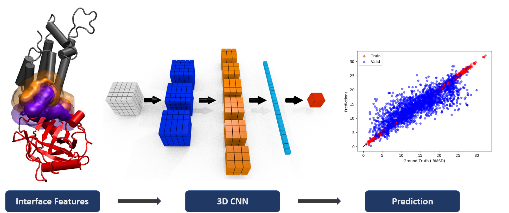

# DeepRank

**Deep Learning for ranking protein-protein conformations**

[](https://travis-ci.org/DeepRank/deeprank)
[](https://www.codacy.com/app/NicoRenaud/deeprank?utm_source=github.com&amp;utm_medium=referral&amp;utm_content=DeepRank/deeprank&amp;utm_campaign=Badge_Grade)
[](http://deeprank.readthedocs.io/?badge=latest)
[](https://coveralls.io/github/DeepRank/deeprank?branch=master)

The documentation of the module can be found on readthedocs :
http://deeprank.readthedocs.io/en/latest/



## 1 . Installation

Minimal information to install the module

* clone the repository `git clone https://github.com/DeepRank/deeprank.git`
* go there             `cd deeprank`
* install the module   `pip install -e ./`
* install freesasa     `https://github.com/freesasa/freesasa-python`
* go int the test dir `cd test`
* run the test suite `pytest`


## 2 . Tutorial

We give here the tutorial like introduction to the DeepRank machinery. More informatoin can be found in the documentation http://deeprank.readthedocs.io/en/latest/.  We quickly illsutrate here the two main steps of Deeprank :
* the generation of the data
* running deep leaning experiments.

### A . Generate the data set (using MPI)

The generation of the data require only require PDBs files of decoys and their native and the PSSM if needed. All the features/targets and mapped features onto grid points will be auomatically calculated and store in a HDF5 file.

```python
from deeprank.generate import *
from mpi4py import MPI

comm = MPI.COMM_WORLD

# adress of the BM4 folder
BM4 = '/path/to/BM4/data/'

# sources to assemble the data base
pdb_source     = ['./1AK4/decoys/']
pdb_native     = ['./1AK4/native/']
pssm_source    = ['./1AK4/pssm_new/']

# output file
h5file = './1ak4.hdf5'

#init the data assembler
database = DataGenerator(pdb_source=pdb_source,
                         pdb_native=pdb_native,
                         pssm_source=pssm_source,
                         data_augmentation = 1,
                         compute_targets  = ['deeprank.targets.dockQ','deeprank.targets.binary_class'],
                         compute_features = ['deeprank.features.AtomicFeature',
                                             'deeprank.features.FullPSSM',
                                             'deeprank.features.PSSM_IC',
                                             'deeprank.features.BSA',
                                             'deeprank.features.ResidueDensity'],
                         hdf5=h5file,mpi_comm=comm)

#create new files
database.create_database(prog_bar=True)

# map the features
grid_info = {
  'number_of_points' : [30,30,30],
  'resolution' : [1.,1.,1.],
  'atomic_densities' : {'CA':3.5,'N':3.5,'O':3.5,'C':3.5},
}

 database.map_features(grid_info,try_sparse=True,time=False,prog_bar=True)
```

This script can be exectuted using for example 4 MPI processes with the command:

```
NP=4
mpiexec -n $NP python generate.py
```


In  the first part of the script we define the path where to find the PDBs of the decoys and natives that we want to have in the dataset. All the .pdb files present in *pdb_source* will be used in the dataset. We need to specify where to find the native conformations to be able to compute RMSD and the dockQ score. For each pdb file detected in *pdb_source*, the code will try to find a native conformation in *pdb_native*.

We then initialize the `DataGenerator` object. This object (defined in `deeprank/generate/DataGenerator.py`) needs a few input parameters:

* pdb_source : where to find the pdb to include in the dataset
* pdb_native : where to find the corresponding native conformations
* compute_targets : list of modules used to compute the targets
* compute_features : list of modules used to compute the features
* hdf5 : Name of the HDF5 file to store the data set

We then create the data base with the command `database.create_database()`. This function autmatically create an HDF5 files where each pdb has its own group. In each group we can find the pdb of the complex and its native form, the calculated features and the calculated targets. We can now mapped the features to a grid. This is done via the command `database.map_features()`. As you can see this method requires a dictionary as input. The dictionary contains the instruction to map the data.

* number_of_points: the number of points in each direction
* resolution : the resolution in Angs
* atomic_densities : {'atom_name' : vvdw_radius} the atomic densities required

The atomic densities are mapped following the [protein-ligand paper](https://arxiv.org/abs/1612.02751). The other features are mapped to the grid points using a Gaussian function (other modes are possible but somehow hard coded)

#### Visualization of the mapped features

To explore the HDf5 file and vizualize the features you can use the dedicated browser https://github.com/DeepRank/DeepXplorer. This tool saloows to dig through the hdf5 file and to directly generate the files required to vizualie the features in VMD or PyMol. An iPython comsole is also embedded to analyze the feature values, plot them etc ....


### B . Deep Learning

The HDF5 files generated above can be used as input for deep learning experiments. You can take a look at the file `test/test_learn.py` for some examples. We give here a quick overview of the process.


```python
from deeprank.learn import *
from deeprank.learn.model3d import cnn as cnn3d
import torch.optim as optim

# input database
database = '1ak4.hdf5'

# declare the dataset instance
data_set = DataSet(database,
            grid_shape=(30,30,30),
            select_feature={'AtomicDensities_ind' : 'all',
                            'Feature_ind' : ['coulomb','vdwaals','charge','pssm'] },
            select_target='DOCKQ',
            normalize_features = True, normalize_targets=True,
            pair_chain_feature=np.add,
            dict_filter={'IRMSD':'<4. or >10.'})


# create the networkt
model = NeuralNet(data_set,cnn3d,model_type='3d',task='reg',
                  cuda=False,plot=True,outdir=out)

# change the optimizer (optional)
model.optimizer = optim.SGD(model.net.parameters(),
                            lr=0.001,
                            momentum=0.9,
                            weight_decay=0.005)

# start the training
model.train(nepoch = 50,divide_trainset=0.8, train_batch_size = 5,num_workers=0)
```


In the first part of the script we create a Torch database from the HDF5 file. We can specify one or several HDF5 files and even select some conformations using the `dict_filter` argument. Other options of `DataSet` can be used to specify the features/targets the normalization, etc ...

We then create a `NeuralNet` instance that takes the dataset as input argument. Several options are available to specify the task to do, the GPU use, etc ... We then have simply to train the model. Simple !
